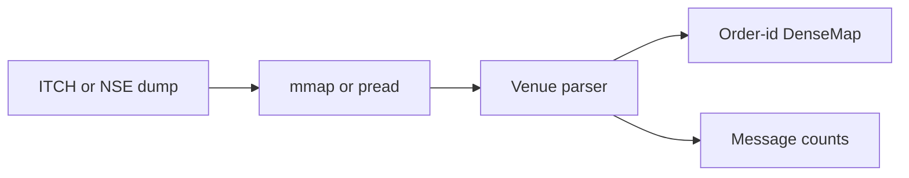

# High-Performance Market Data Parser

A C++20 file parser for NASDAQ TotalView-ITCH 5.0 and NSE FO snapshots. Built for full-tape replay: `mmap` / `pread`, packed structs, and an order-id map with no heap traffic on the add/delete path.

  [](https://github.com/PIYUSH-KUMAR1809/market-data-parser/actions/workflows/ci.yml)

> **Performance Benchmark (v2.0)**: **~11.36 million ITCH msgs/s** | **25.88 s** for 293,989,079 messages (8,616 MiB) on Apple M1 Pro. **~4.7×** vs v1.0 on the same file.

Bring your own licensed dumps. This repository does not redistribute exchange data.

### Key Takeaways

*   **I/O**: ITCH is `mmap` + `MADV_SEQUENTIAL`. NSE FO is 256 MiB double-buffer `pread`.
*   **Book**: One global order-id map (`id → side, price, qty, symbol[8]`). Not a price-level ladder.
*   **Memory**: `DenseMap` open-addressing plus `std::pmr` arenas. Order objects are PODs.
*   **ITCH dispatch**: Mutates on `A F E C X D U`. Length-skips `S R H Y L V W K J h P Q B I N` (including trades `P`/`Q`).

---

## Key Features

*   **NASDAQ ITCH 5.0**: Length-prefixed TotalView-ITCH file replay. Locate filter and parser merge included.
*   **NSE FO snapshot**: Packed `SnapshotRecord`, invalid tokens skipped, parallel scan on large files.
*   **NSE L2 (optional)**: JSONL `payload_hex` or raw UDP + miniLZO (`FT` / `FN` / `PN`). Off by default — miniLZO is GPL-2+. Enable with `-DENABLE_NSE_L2_LZO=ON`.
*   **Zero-copy parse path**: Direct buffer casting, branch-light endian conversion, no per-message heap allocation on add/delete.
*   **DenseMap**: Custom open-addressing map instead of `std::unordered_map`.
*   **File replay only**: `config.toml` `[network]` is unused.

---

## Architecture



1.  **Ingestion**: The CLI maps or streams a local file. No multicast join.
2.  **Decode**: Packed big-endian structs. ITCH walks 2-byte length prefixes. NSE FO walks fixed `SnapshotRecord`s.
3.  **Book**: Adds, executes, cancels, deletes, and replaces update a single order-id map. Skipped ITCH types advance the cursor only.
4.  **NSE L2**: Optional miniLZO decompress, then FT/FN/PN recognize. `FN` is logged; it does not update the map.

---

## Performance

**v1.0** vs **v2.0**, same machine and files, Release, median of 3 runs (2026-09-08).

| | |
| --- | --- |
| Hardware | Apple M1 Pro, 8-core, arm64 |
| Compiler | Apple clang 21.0.0 (`clang-2100.1.1.101`) |
| Flags | `-O3 -flto -mcpu=apple-m1` |
| ITCH | `01302019.NASDAQ_ITCH50` — 8,616 MiB, 293,989,079 messages |
| NSE FO | `FO_SnapshotData26_12_2025.bin` — 13,118 MiB, 484,860 orders |

**NASDAQ ITCH 5.0**

```bash
./build/market_data_parser <file> itch
```

| Version | Time | Throughput | Resting orders (EOF) |
| --- | ---: | ---: | ---: |
| v1.0 | 122.15 s | 2.41 M msgs/s | 223,537 |
| v2.0 | 25.88 s | 11.36 M msgs/s | 0 |

v2.0 looks up by order reference in one map. On this tape every add is later filled, canceled, or deleted. v1.0 looked up by symbol shard, so some deletes missed.

**NSE FO snapshot**

```bash
./build/market_data_parser <file> nse
```

| Version | Time | Active orders |
| --- | ---: | ---: |
| v1.0 | 27.83 s | 484,860 |
| v2.0 | 3.43 s | 484,860 |

### Microbenchmarks

`benchmark_runner` times an in-process parse of the first 500 MiB of each file when those files are in the working directory.

```bash
./build/benchmark_runner
```

ITCH samples: [NASDAQ EMI](https://emi.nasdaq.com/ITCH/Nasdaq%20ITCH/).

---

## Build and Run

### Prerequisites

*   C++20 compiler (GCC 10+ / Clang 12+)
*   CMake 3.20+

### Compiling

```bash
cmake -B build -S . -DCMAKE_BUILD_TYPE=Release
cmake --build build -j
```

### Running parsers

```bash
./run_itch.sh
./run_nse.sh
```

Synthetic file (no exchange data):

```bash
python3 generate_data.py
./build/market_data_parser data/test_data.bin itch
```

NSE L2 (opt-in GPL):

```bash
cmake -B build -S . -DENABLE_NSE_L2_LZO=ON
cmake --build build -j
./build/market_data_parser capture.jsonl nse_l2_jsonl
```

### Testing

```bash
ctest --test-dir build --output-on-failure
```

Sanitizers (unit tests):

```bash
cmake -B build -S . -DCMAKE_BUILD_TYPE=Debug -DENABLE_SANITIZERS=ON
cmake --build build -j --target unit_tests
ctest --test-dir build --output-on-failure
```

See [CONTRIBUTING.md](CONTRIBUTING.md).

---

## Support

This project is free and MIT-licensed. If it was useful — for a replay, a benchmark, or learning how ITCH/NSE dumps are laid out — you can buy me a coffee. Completely optional.

[](https://www.buymeacoffee.com/kpiyush8826)
